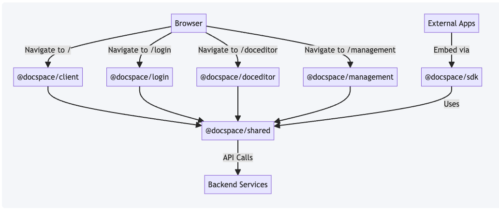
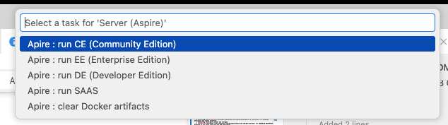
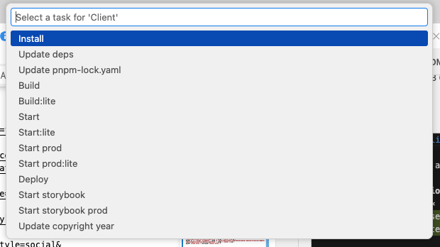

# ONLYOFFICE DocSpace Client

[](https://github.com/ONLYOFFICE/DocSpace/releases)
[](https://opensource.org/license/agpl-v3)
[](https://star-history.com/#ONLYOFFICE/DocSpace)
[](https://github.com/ONLYOFFICE/DocSpace/issues)

This repository contains the **frontend** for [ONLYOFFICE DocSpace](https://github.com/ONLYOFFICE/DocSpace) — a room-based collaborative platform for document management.

> For the full product overview, see the [main repository README](https://github.com/ONLYOFFICE/DocSpace#readme).
> For the backend setup and architecture, see the [server README](https://github.com/ONLYOFFICE/DocSpace-server#readme).

## Table of Contents

- [Technology Stack](#technology-stack)
- [Project Structure](#project-structure)
- [Git Submodules](#git-submodules)
- [Getting Started](#getting-started)
  - [Prerequisites](#prerequisites)
  - [Quick Start](#quick-start)
  - [Running Individual Applications](#running-individual-applications)
  - [Development with VSCode](#development-with-vscode)
  - [Clear Aspire Docker Artifacts](#clear-aspire-docker-artifacts)
- [Browser Support](#browser-support)
- [Testing](#testing)
  - [Static Analysis](#static-analysis)
  - [Unit Tests](#unit-tests)
  - [Common Tests](#common-tests)
  - [E2E Testing with Playwright](#e2e-testing-with-playwright)
  - [CI/CD Pipeline](#cicd-pipeline)
- [Troubleshooting](#troubleshooting)
- [Contributing](#contributing)
- [Licensing](#licensing)

## Technology Stack

- **Language:** TypeScript 5.9 (strict mode)
- **Framework:** React 19 with React Compiler
- **State Management:** MobX 6
- **Styling:** CSS/SASS, Styled-Components 5
- **Internationalization:** i18next
- **Bundler:** Webpack 5
- **Server Rendering:** Next.js
- **Testing:** Vitest, Playwright
- **Linting:** Biome
- **Package Manager:** pnpm 10.28+ (workspaces)
- **Monorepo:** Nx

## Project Structure

This project is organized as a **pnpm monorepo** managed with **Nx**, containing 6 packages with clear separation of concerns.

```
packages/
├── client/         # Main DocSpace application
├── login/          # Authentication & authorization
├── doceditor/      # Document editor interface
├── management/     # Admin management panel
├── sdk/            # JavaScript SDK for external integrations
└── shared/         # Shared components, hooks, stores, utilities
```

### Package Responsibilities

#### `@docspace/client` - Main Application
**Purpose:** Core DocSpace web application

**Features:**
- Home dashboard and navigation
- File and folder management
- Room creation and management (Public, Collaboration, VDR, Custom)
- User and group management
- Third-party integrations
- Settings and preferences

**Tech Stack:** Webpack 5, React 19, MobX 6
**Entry Point:** `packages/client/src/index.tsx`

#### `@docspace/login` - Authentication
**Purpose:** Handles all authentication flows

**Features:**
- Email/password login
- Two-factor authentication (2FA)
- Single Sign-On (SSO) via SAML
- Password reset and recovery
- User registration (when enabled)

**Tech Stack:** Webpack 5, React 19
**Entry Point:** `packages/login/src/index.tsx`

#### `@docspace/doceditor` - Document Editor
**Purpose:** ONLYOFFICE Document Editor integration

**Features:**
- View and edit documents, spreadsheets, presentations
- Real-time collaboration
- Comments and track changes
- Editor plugins support
- Mobile-responsive interface

**Tech Stack:** Webpack 5, React 19, ONLYOFFICE Docs API
**Entry Point:** `packages/doceditor/src/index.tsx`

#### `@docspace/management` - Admin Panel
**Purpose:** Administrative management interface

**Features:**
- System administration
- Analytics and reporting
- Advanced settings
- Tenant management (SaaS mode)
- Usage statistics

**Tech Stack:** Webpack 5, React 19
**Entry Point:** `packages/management/src/index.tsx`

#### `@docspace/sdk` - JavaScript SDK
**Purpose:** External integration SDK for third-party applications

**Features:**
- Embeddable DocSpace components
- JavaScript API for external apps
- Frame integration support
- Public API wrappers

**Tech Stack:** TypeScript, Rollup
**Entry Point:** `packages/sdk/src/index.ts`
**Documentation:** [JavaScript SDK Docs](https://api.onlyoffice.com/docspace/javascript-sdk/get-started/)

#### `@docspace/shared` - Shared Library
**Purpose:** Core shared library used by all applications

**Structure:**
```
packages/shared/
├── components/         # 130+ reusable React components
├── hooks/             # Custom React hooks
├── store/             # MobX state management
├── api/               # API client and services
├── utils/             # Utility functions
├── types/             # TypeScript type definitions
├── dialogs/           # Modal dialog components
├── themes/            # Theme definitions
└── enums/             # Enumerations and constants
```

### Application Flow



### Build System

- **Build Tool:** Nx with custom executors
- **Module Bundler:** Webpack 5 (apps), Rollup (SDK)
- **Cache:** Nx computation caching for fast rebuilds
- **Parallel Builds:** All packages can build independently

### Key Dependencies

All applications depend on `@docspace/shared`, which provides:
- Consistent UI components
- Centralized state management
- Unified API layer
- Shared types and utilities
- Common business logic

### Git Submodules

This repository uses a git submodule for the UI component library:

#### `libs/ui-kit` - UI Component Library

**Purpose:** Shared UI component library for DocSpace applications

**Repository:** [docspace-ui-kit-react](https://github.com/ONLYOFFICE/docspace-ui-kit-react)
**Location:** `libs/ui-kit/`

**Features:**
- 90+ React components (Button, Input, Modal, Table, etc.)
- Custom hooks and contexts
- Theme system with Base/Dark modes
- Internationalization support
- TypeScript types and utilities

**Working with the submodule:**

```bash
# Clone repository with submodules
git clone --recurse-submodules https://github.com/ONLYOFFICE/DocSpace.git

# If already cloned without submodules, initialize them
git submodule update --init --recursive

# Update submodule to latest commit
cd libs/ui-kit
git pull origin develop
cd ../..
git add libs/ui-kit
git commit -m "Update ui-kit submodule"

# Check submodule status
git submodule status
```

**Documentation:** See [libs/ui-kit/README.md](https://github.com/ONLYOFFICE/docspace-ui-kit-react#readme) for component documentation and usage examples.

## Getting Started

> **Note:** The frontend requires a running backend. See the [server README](https://github.com/ONLYOFFICE/DocSpace-server#readme) for backend setup instructions.

### Prerequisites

| Tool | Version | Verification Command |
|------|---------|---------------------|
| [Node.js](https://nodejs.org/) | >= 24 | `node --version` |
| [pnpm](https://pnpm.io/) | >= 10.28.0 | `pnpm --version` |
| [.NET SDK](https://dotnet.microsoft.com/download) | 10.0 | `dotnet --version` |
| [Docker](https://www.docker.com/) | >= 28.5.0 | `docker --version` |

### Quick Start

> **Note:** This repository uses git submodules. If you haven't cloned with `--recurse-submodules`, run `git submodule update --init --recursive` first. See [Git Submodules](#git-submodules) for details.

**Terminal 1 - Start backend:**
```bash
# From the DocSpace root
cd server/common/ASC.AppHost
dotnet run --launch-profile frontend-dev
```

**Terminal 2 - Start frontend:**
```bash
# From the DocSpace root
cd client
pnpm install && pnpm start
```

**Access the application:**
- DocSpace: http://localhost:8092
- Aspire Dashboard: http://localhost:15208

### Backend Editions

By default, the backend runs in **Community Edition (CE)** mode. You can run different editions by setting the `APP_EDITION` environment variable.

**Choose and run one of the following commands:**

```bash
# From the DocSpace root
cd server/common/ASC.AppHost

# Community Edition (CE) - default, no license required
dotnet run --launch-profile frontend-dev

# Enterprise Edition (EE) - requires license file
APP_EDITION=enterprise dotnet run --launch-profile frontend-dev

# Developer Edition (DE) - requires license file
APP_EDITION=developer dotnet run --launch-profile frontend-dev

# SAAS mode (multi-tenant)
dotnet run --launch-profile frontend-dev --APP_HOSTING_STANDALONE false
```

> **Note:** Enterprise Edition (EE) and Developer Edition (DE) require a valid license file. See the [server README](https://github.com/ONLYOFFICE/DocSpace-server#launch-profiles) for details on launch profiles and backend configuration.

### Running Individual Applications

**Choose and run one of the following commands:**

**Developer mode:**
```bash
# Run only client
cd packages/client && pnpm start

# Run only login
cd packages/login && pnpm start

# Run only doceditor
cd packages/doceditor && pnpm start

# Run only management
cd packages/management && pnpm start

# Run all (from root)
pnpm start

# Run core apps only (client, login, doceditor)
pnpm start:lite
```

**Production mode:**
```bash
pnpm start-prod       # All apps
pnpm start-prod:lite  # Core apps only
```

### Development with VSCode

The recommended way to develop the frontend is using the VSCode workspace, which provides task buttons to start backend and frontend with one click.

**1. Open the workspace:**

```bash
code client/frontend.code-workspace
```

**2. Install the [Task Buttons](https://marketplace.visualstudio.com/items?itemName=spencerwmiles.vscode-task-buttons) extension** (`spencerwmiles.vscode-task-buttons`) for convenient toolbar buttons.

**3. Use task buttons to start services:**

Start the backend and frontend directly from the VSCode toolbar:

**Backend tasks:**



**Frontend tasks:**




Tasks are also available through the standard VSCode task menu (`Terminal → Run Task`).

> For C# backend development with VSCode, see the [Server README](https://github.com/ONLYOFFICE/DocSpace-server#development-with-vscode).

### Clear Aspire Docker Artifacts

Linux/macOS (bash):
```bash
docker ps -a --format '{{.Names}}' | grep -E 'mysql|redis|cache-|rabbitmq|messaging-|opensearch|mailpit|dbgate|redisinsight|onlyoffice-editors|openresty' | xargs -r docker stop && \
docker ps -a --format '{{.Names}}' | grep -E 'mysql|redis|cache-|rabbitmq|messaging-|opensearch|mailpit|dbgate|redisinsight|onlyoffice-editors|openresty' | xargs -r docker rm && \
docker volume prune -f && docker network prune -f
```

Windows (PowerShell):
```powershell
$c = docker ps -a --format '{{.Names}}' | Where-Object { $_ -match 'mysql|redis|cache-|rabbitmq|messaging-|opensearch|mailpit|dbgate|redisinsight|onlyoffice-editors|openresty' }; if ($c) { $c | ForEach-Object { docker stop $_ }; $c | ForEach-Object { docker rm $_ } }; docker volume prune -f; docker network prune -f
```

## Browser Support

| Browser | Minimum Version |
|---------|----------------|
| Chrome | Latest 2 versions |
| Firefox | Latest 2 versions |
| Safari | Latest 2 versions |
| Edge | Latest 2 versions |

Mobile browsers are supported on iOS 14+ and Android 8+.

## Testing

### Static Analysis

```bash
# Biome linting (all packages)
pnpm lint

# Auto-fix lint issues
pnpm lint:fix

# TypeScript type checking (all packages)
pnpm tsc
```

### Unit Tests

Unit tests use [Vitest](https://vitest.dev/) and cover shared components, hooks, and utilities in `@docspace/shared`.

```bash
# Run all unit tests
pnpm test

# Run with interactive UI
cd packages/shared && pnpm test:ui

# Run with coverage report
cd packages/shared && pnpm test:coverage
```

### Common Tests

Asset validation and quality checks located in `common/tests/`:

```bash
cd common/tests

# Run all common tests
npm test

# Individual test suites
npm run test:locales        # Translation completeness validation
npm run test:images         # Image asset validation
npm run test:colors         # Color palette validation
npm run test:ascii          # ASCII character validation
npm run test:dependencies   # Dependency audit and security checks
```

Additional quality checks from the root:

```bash
# License compliance audit
pnpm licenses-audit

# Dependency security audit
pnpm audit --audit-level=moderate
```

### E2E Testing with Playwright

This project uses [Playwright](https://playwright.dev/) for end-to-end testing. Tests are run in **Docker containers** to ensure consistency across different development environments.

#### Why Docker for E2E Tests?

- **Consistency:** Same environment for all developers (fonts, browsers, OS)
- **Reproducibility:** Tests produce identical results on any machine
- **Isolation:** Tests don't affect your local system
- **Screenshot Accuracy:** Visual regression tests require pixel-perfect consistency
- **CI/CD Ready:** Same environment in local and CI pipelines

#### Running E2E Tests

**First time setup (build Docker image):**
```bash
cd packages/client
pnpm test:e2e:docker:build
```

**Run all E2E tests:**
```bash
cd packages/client
pnpm test:e2e:docker:start
```

**Run tests for specific package:**
```bash
# Client tests
cd packages/client && pnpm test:e2e:docker:start

# Login tests
cd packages/login && pnpm test:e2e:docker:start

# Doceditor tests
cd packages/doceditor && pnpm test:e2e:docker:start

# SDK tests
cd packages/sdk && pnpm test:e2e:docker:start

# Management tests
cd packages/management && pnpm test:e2e:docker:start
```

**Run all packages tests (unified approach):**
```bash
# From repository root
cd client

# Build unified E2E Docker image
docker compose -f docker/e2e/compose.yaml build e2e-tests

# Run all tests
docker compose -f docker/e2e/compose.yaml run --rm \
  -e RUN_CLIENT=true \
  -e RUN_LOGIN=true \
  -e RUN_DOCEDITOR=true \
  -e RUN_SDK=true \
  -e RUN_MANAGEMENT=true \
  e2e-tests
```

**Run single test file:**
```bash
cd packages/client
pnpm exec playwright test path/to/test.spec.ts
```

#### Updating Reference Screenshots

**IMPORTANT:** Always update screenshots through Docker to maintain consistency!

```bash
cd packages/client
pnpm test:e2e:docker:update-screenshots
```

This command:
1. Runs tests in Docker
2. Generates new screenshots in the same environment
3. Updates reference screenshots with a **0.16 threshold** for visual comparison

**Why use Docker for screenshots?**
- Font rendering differs between OS (macOS vs Linux vs Windows)
- Browser behavior varies slightly across platforms
- Docker ensures screenshots are generated in the **exact same environment** as CI/CD

#### Viewing Test Reports

After running tests, view the HTML report:

```bash
# Client report (port 9325)
cd packages/client
pnpm exec playwright show-report --port 9325

# Login report (port 9326)
cd packages/login
pnpm exec playwright show-report --port 9326

# Doceditor report (port 9327)
cd packages/doceditor
pnpm exec playwright show-report --port 9327

# SDK report (port 9328)
cd packages/sdk
pnpm exec playwright show-report --port 9328

# Management report (port 9329)
cd packages/management
pnpm exec playwright show-report --port 9329
```

#### Cleaning Up E2E Environment

**Remove package-specific Docker image:**
```bash
cd packages/client
pnpm test:e2e:docker:clear
```

**Remove unified E2E Docker image:**
```bash
cd client
docker compose -f docker/e2e/compose.yaml down --volumes --remove-orphans --rmi all
```

#### Test Configuration

- **Test Framework:** Playwright
- **Browsers:** Chromium, Firefox, WebKit
- **Screenshot Threshold:** 0.16 (16% pixel difference allowed)
- **Timeout:** 30 seconds per test
- **Retries:** 2 retries on failure (CI only)

#### Writing New Tests

Tests are located in `packages/*/src/__tests__/` directories. Example:

```typescript
import { test, expect } from '@playwright/test';

test('should display dashboard', async ({ page }) => {
  await page.goto('http://localhost:8092');
  await expect(page).toHaveTitle(/DocSpace/);

  // Visual regression test
  await expect(page).toHaveScreenshot('dashboard.png', {
    threshold: 0.16,
  });
});
```

#### Debugging Tests

**Run tests in headed mode (with browser UI):**
```bash
cd packages/client
pnpm exec playwright test --headed
```

**Run tests in debug mode:**
```bash
cd packages/client
pnpm exec playwright test --debug
```

**Trace viewer (for failed tests):**
```bash
cd packages/client
pnpm exec playwright show-trace trace.zip
```

### CI/CD Pipeline

The [frontend-common-tests](.github/workflows/frontend-common-tests.yaml) GitHub Actions workflow runs automatically on pushes and pull requests to `develop`, `release/*`, and `hotfix/*` branches.

**Pipeline stages:**

1. **Changes Detection** — determines which tests to run based on changed files
2. **Static Analysis & Tests** — runs in parallel:
   - Biome linting
   - TypeScript compilation
   - Unit tests (Vitest)
   - Common tests (images, colors, ASCII, locales)
   - Dependency audit and license compliance
3. **E2E Tests** — Playwright tests per package (client, login, doceditor, SDK, management), each running in Docker containers

Only affected tests run — for example, changes in `packages/login/` trigger only Login E2E tests, while changes in `packages/shared/` trigger all E2E suites.

## Troubleshooting

<details>
<summary><b>pnpm install fails</b></summary>

1. Clear pnpm cache: `pnpm store prune`
2. Delete node_modules: `rm -rf node_modules`
3. Delete pnpm-lock.yaml: `rm pnpm-lock.yaml`
4. Reinstall: `pnpm install`
</details>

<details>
<summary><b>Port 8092 is already in use</b></summary>

Kill the process using the port:
```bash
# macOS/Linux
lsof -ti:8092 | xargs kill -9

# Windows
netstat -ano | findstr :8092
taskkill /PID <PID> /F
```
</details>

<details>
<summary><b>Backend issues</b></summary>

See the [server README troubleshooting section](https://github.com/ONLYOFFICE/DocSpace-server#troubleshooting) for Docker and backend-related issues.
</details>

For more issues, check our [Issue Tracker](https://github.com/ONLYOFFICE/DocSpace/issues) or [Forum](https://forum.onlyoffice.com/).

## Contributing

### Development Workflow

1. **Fork** the repository
2. **Clone** your fork: `git clone https://github.com/YOUR_USERNAME/DocSpace.git`
3. **Create** a feature branch: `git checkout -b feature/amazing-feature`
4. **Make** your changes
5. **Run** tests: `pnpm test`
6. **Lint** your code: `pnpm lint:fix`
7. **Commit** your changes: `git commit -m 'Add amazing feature'`
8. **Push** to your fork: `git push origin feature/amazing-feature`
9. **Open** a Pull Request

### Code Standards

- Follow TypeScript and React best practices
- Run `pnpm lint` before committing
- Write tests for new features
- Keep commits atomic and well-described

### Pre-push Hooks (Lefthook)

This project uses [Lefthook](https://github.com/evilmartians/lefthook) for automated quality checks before pushing code.

**Automatically runs before push:**
1. TypeScript type checking (`pnpm tsc`)
2. Biome linting (`pnpm lint`)
3. Translation validation tests
4. Unit tests (`pnpm test`)

Lefthook is automatically installed with `pnpm install`. Configuration is stored in `lefthook.yml` at the repository root.

**Skip hooks (use with caution):**
```bash
# Skip all hooks
LEFTHOOK=0 git push

# Skip specific hook
LEFTHOOK_EXCLUDE=tests git push
```

### Commit Message Convention

Follow [Conventional Commits](https://www.conventionalcommits.org/):
- `feat:` New feature
- `fix:` Bug fix
- `docs:` Documentation changes
- `style:` Code style changes
- `refactor:` Code refactoring
- `test:` Test changes
- `chore:` Build/tooling changes

## Licensing

ONLYOFFICE DocSpace is released under AGPLv3 license. See the LICENSE file for more information.

## Need help for developers? 

Check our [official API documentation](https://api.onlyoffice.com/docspace/).