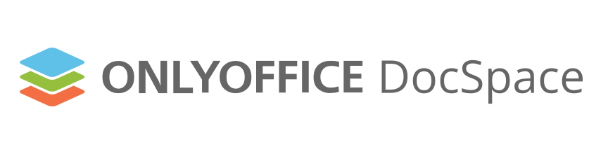

[](https://github.com/ONLYOFFICE/DocSpace/releases)
[](https://opensource.org/license/agpl-v3)
[](https://star-history.com/#ONLYOFFICE/DocSpace)
[](https://github.com/ONLYOFFICE/DocSpace/issues)
[](https://forum.onlyoffice.com/c/docspace/46)
[](https://x.com/only_office)
[](https://www.youtube.com/@Onlyoffice_Community)

## Table of Contents

- [Overview](#overview)
- [Functionality](#functionality)
- [Technology Stack](#technology-stack)
- [Project Structure](#project-structure)
- [System Requirements](#minimum-system-requirements)
- [Getting Started](#development-environment-setup)
  - [Prerequisites](#prerequisites)
  - [Quick Start](#quick-start)
  - [Backend Setup](#2-start-backend-aspire)
  - [Frontend Setup](#3-start-frontend-pnpm)
- [Development Tools](#4-access-the-application)
- [VSCode Integration](#vscode-workspace-optional)
- [Port Allocation](#port-allocation)
- [Browser Support](#browser-support)
- [Testing](#testing)
  - [E2E Testing with Playwright](#e2e-testing-with-playwright)
- [Troubleshooting](#troubleshooting)
- [Contributing](#contributing)
- [Documentation](#documentation)
- [Security](#security)
- [Production Versions](#production-ready-versions)
- [License](#licensing)
- [Support](#user-feedback-and-support)

## Overview

ONLYOFFICE DocSpace is a document hub where you can connect users and documents in one place to boost collaboration.

<a href="https://www.youtube.com/watch?v=DU14HFeZErU&ab_channel=ONLYOFFICE" target="_blank"></a>

## Functionality

- 🚪 Various room types: [Public rooms](https://www.onlyoffice.com/public-rooms), [Form filling rooms](https://www.onlyoffice.com/form-filling-rooms), [Collaboration rooms](https://www.onlyoffice.com/collaboration-rooms), [Virtual Data Rooms](https://www.onlyoffice.com/virtual-data-rooms), [Custom rooms](https://www.onlyoffice.com/custom-rooms).
- 🔑 Flexible access permissions: viewing, commenting, reviewing, form filling, editing.
- 📄 Ability to work with multiple file formats: text documents, spreadsheets, presentations, digital forms, PDFs, e-books, media files (images, video and audio files), markdown files.
- 🤝 [Document collaboration](https://www.onlyoffice.com/seamless-collaboration): two co-editing modes, track changes, comments, built-in chat, plugins for making audio and video calls.
- 🤖 Connecting any [AI assistants](https://www.onlyoffice.com/ai-assistants) to the editors for enhanced efficiency and faster workflows.
- ☁️ Connecting third-party clouds and storages.
- 💻 [JavaScript SDK](https://api.onlyoffice.com/docspace/javascript-sdk/get-started/) for embedding ONLYOFFICE DocSpace or its parts into your own web application.
- 🧩 [Plugins SDK](https://api.onlyoffice.com/docspace/plugins-sdk/get-started/) for creating own plugins and adding them to DocSpace.
- 🧑‍🤝‍🧑 LDAP settings for importing users and groups from an LDAP server.
- 🛡️ Single Sign-On (SSO) settings for enabling third-party authentication using SAML.
- 🛠️ Developer tools: webhooks, OAuth applications, API keys.
- 🔒 Security tools: two-factor authentication, backup and restore features, IP security, audit trail, and much more.
- 🚚 Migration from other platforms, such as Google Workspace, Nextcloud, ONLYOFFICE Workspace.
- 🔌 Ready-to-use connectors for integration with your platform: Drupal, Pipedrive, WordPress, Zapier, Zoom, Moodle. [See all connectors](https://www.onlyoffice.com/all-connectors)

## Technology Stack

### Backend
- **Language:** C# 14.0
- **Runtime:** .NET 10.0 with ASP.NET Core
- **Database:** MySQL 9.5
- **Messaging:** RabbitMQ
- **Caching:** Redis
- **Search:** OpenSearch
- **Orchestration:** .NET Aspire

### Frontend
- **Language:** TypeScript 5.9 (strict mode)
- **Framework:** React 19 with React Compiler
- **State Management:** MobX 6
- **Styling:** CSS/SASS, Styled-Components 5
- **Internationalization:** i18next
- **Bundler:** Webpack 5
- **Server Rendering:** Next.js
- **Testing:** Vitest, Playwright
- **Linting:** Biome

### Infrastructure
- **Containerization:** Docker 28.5+
- **Package Manager:** pnpm 10.28+ (workspaces)
- **Monorepo:** Nx

## Project Structure

This project is organized as a **pnpm monorepo** managed with **Nx**, containing 6 packages with clear separation of concerns.

### Monorepo Overview

```
packages/
├── client/         # Main DocSpace application
├── login/          # Authentication & authorization
├── doceditor/      # Document editor interface
├── management/     # Admin management panel
├── sdk/            # JavaScript SDK for external integrations
└── shared/         # Shared components, hooks, stores, utilities
```

### Package Responsibilities

#### 📱 `@docspace/client` - Main Application
**Purpose:** Core DocSpace web application

**Features:**
- 🏠 Home dashboard and navigation
- 📁 File and folder management
- 🚪 Room creation and management (Public, Collaboration, VDR, Custom)
- 👥 User and group management
- 🔌 Third-party integrations
- ⚙️ Settings and preferences

**Tech Stack:** Webpack 5, React 19, MobX 6
**Entry Point:** `packages/client/src/index.tsx`

#### 🔐 `@docspace/login` - Authentication
**Purpose:** Handles all authentication flows

**Features:**
- 📧 Email/password login
- 🔑 Two-factor authentication (2FA)
- 🛡️ Single Sign-On (SSO) via SAML
- 🔄 Password reset and recovery
- 👤 User registration (when enabled)

**Tech Stack:** Webpack 5, React 19
**Entry Point:** `packages/login/src/index.tsx`

#### 📝 `@docspace/doceditor` - Document Editor
**Purpose:** ONLYOFFICE Document Editor integration

**Features:**
- 📄 View and edit documents, spreadsheets, presentations
- ✏️ Real-time collaboration
- 💬 Comments and track changes
- 🔌 Editor plugins support
- 📱 Mobile-responsive interface

**Tech Stack:** Webpack 5, React 19, ONLYOFFICE Docs API
**Entry Point:** `packages/doceditor/src/index.tsx`

#### ⚙️ `@docspace/management` - Admin Panel
**Purpose:** Administrative management interface

**Features:**
- 👑 System administration
- 📊 Analytics and reporting
- 🔧 Advanced settings
- 🏢 Tenant management (SaaS mode)
- 📈 Usage statistics

**Tech Stack:** Webpack 5, React 19
**Entry Point:** `packages/management/src/index.tsx`

#### 💻 `@docspace/sdk` - JavaScript SDK
**Purpose:** External integration SDK for third-party applications

**Features:**
- 🔌 Embeddable DocSpace components
- 🌐 JavaScript API for external apps
- 🎯 Frame integration support
- 📚 Public API wrappers

**Tech Stack:** TypeScript, Rollup
**Entry Point:** `packages/sdk/src/index.ts`
**Documentation:** [JavaScript SDK Docs](https://api.onlyoffice.com/docspace/javascript-sdk/get-started/)

#### 📦 `@docspace/shared` - Shared Library
**Purpose:** Core shared library used by all applications

**Structure:**
```
packages/shared/
├── components/         # 130+ reusable React components
│   ├── article/       # Layout components
│   ├── button/        # Button variants
│   ├── text-input/    # Form inputs
│   ├── selector/      # Dropdowns and selectors
│   └── ...
├── hooks/             # Custom React hooks
│   ├── useDevice      # Device detection
│   ├── useTheme       # Theme management
│   └── ...
├── store/             # MobX state management
│   ├── AuthStore      # Authentication state
│   ├── UserStore      # User information
│   ├── SettingsStore  # Application settings
│   └── ...
├── api/               # API client and services
│   ├── files/         # Files API
│   ├── people/        # Users API
│   ├── rooms/         # Rooms API
│   └── ...
├── utils/             # Utility functions
│   ├── device         # Device utilities
│   ├── common         # Common helpers
│   └── ...
├── types/             # TypeScript type definitions
├── dialogs/           # Modal dialog components
├── themes/            # Theme definitions
└── enums/             # Enumerations and constants
```

**Key Features:**
- 🎨 Design system components
- 📱 Responsive utilities
- 🌍 i18n translations
- 🎯 Type-safe APIs
- 🔄 State management

### Application Flow

```mermaid
graph TD
    A[Browser] -->|Navigate to /| B[@docspace/client]
    A -->|Navigate to /login| C[@docspace/login]
    A -->|Navigate to /doceditor| D[@docspace/doceditor]
    A -->|Navigate to /management| E[@docspace/management]

    B --> F[@docspace/shared]
    C --> F
    D --> F
    E --> F

    F -->|API Calls| G[Backend Services]

    H[External Apps] -->|Embed via| I[@docspace/sdk]
    I -->|Uses| F
```

### Build System

- **Build Tool:** Nx with custom executors
- **Module Bundler:** Webpack 5 (apps), Rollup (SDK)
- **Cache:** Nx computation caching for fast rebuilds
- **Parallel Builds:** All packages can build independently

### Key Dependencies

All applications depend on `@docspace/shared`, which provides:
- ✅ Consistent UI components
- ✅ Centralized state management
- ✅ Unified API layer
- ✅ Shared types and utilities
- ✅ Common business logic

### Running Individual Applications

```bash
# Run only client
cd packages/client && pnpm start

# Run only login
cd packages/login && pnpm start

# Run only doceditor
cd packages/doceditor && pnpm start

# Run only management
cd packages/management && pnpm start

# Run all (from root)
pnpm start

# Run core apps only (client, login, doceditor)
pnpm start:lite
```

## Minimum System Requirements

- 💻 **CPU:** Dual-core 2 GHz or higher
- 💾 **RAM:** 16 GB or more
- 💽 **SSD:** At least 40 GB of free space
- 🔄 **Swap file:** At least 2 GB
- 🐳 **[Docker](https://www.docker.com/):** Version 28.5.0 or later
- 💻 **OS:** macOS, Linux, or Windows with WSL2

## Development Environment Setup

> **Note:** DO NOT USE THIS VERSION IN PRODUCTION ENVIRONMENTS.
> The following instructions create a **development/testing environment**
> not suitable for production use. For production deployment, see:
> [Production Version of ONLYOFFICE DocSpace](https://www.onlyoffice.com/download#docspace-enterprise)

### Prerequisites

Before you begin, ensure you have the following installed:

| Tool | Version | Verification Command |
|------|---------|---------------------|
| [Node.js](https://nodejs.org/) | >= 24 | `node --version` |
| [pnpm](https://pnpm.io/) | >= 10.28.0 | `pnpm --version` |
| [.NET SDK](https://dotnet.microsoft.com/download) | 10.0 | `dotnet --version` |
| [Docker](https://www.docker.com/) | >= 28.5.0 | `docker --version` |

**Verify your installation:**
```bash
node --version && pnpm --version && dotnet --version && docker --version
```

### Quick Start

For experienced developers who want to start quickly:

**Terminal 1 - Clone and start backend:**
```bash
# Clone and setup
git clone --recurse-submodules https://github.com/ONLYOFFICE/DocSpace
cd DocSpace

# Start backend (Community Edition) - this will block the terminal
cd server/common/ASC.AppHost
dotnet run --launch-profile frontend-dev
```

**Terminal 2 - Start frontend (open new terminal):**
```bash
# Navigate to the cloned repository
cd DocSpace/client

# Install dependencies and start
pnpm install && pnpm start
```

**Access the application:**
- DocSpace: http://localhost:8092
- Aspire Dashboard: http://localhost:15208

For detailed setup instructions, continue reading below.

### 1. Clone the Repository

```bash
git clone --recurse-submodules https://github.com/ONLYOFFICE/DocSpace && \
cd "$(basename "$_" .git)" && \
git submodule foreach "git checkout master"
```

### 2. Start Backend (Aspire)

Navigate to the Aspire project directory:
```bash
cd server/common/ASC.AppHost
```

Choose one of the following editions:

**Community Edition (CE):**
```bash
dotnet run --launch-profile frontend-dev
```

**Enterprise Edition (EE) - requires license:**
```bash
DOTNET_ENVIRONMENT=enterprise dotnet run --launch-profile frontend-dev
```

**Developer Edition (DE) - requires license:**
```bash
DOTNET_ENVIRONMENT=developer dotnet run --launch-profile frontend-dev
```

> **Note:** To obtain licenses, visit:
> - [Enterprise Edition License](https://www.onlyoffice.com/docspace-prices)
> - [Developer Edition License](https://www.onlyoffice.com/docspace-developer-prices)

The backend will start with all required services (MySQL, Redis, RabbitMQ, OpenSearch, etc.) orchestrated by .NET Aspire.

> **Note:** Aspire will launch multiple services in the terminal. Some services run directly in the terminal, while others run in Docker containers. To stop all services, press `Ctrl+C` in the terminal. If you need to completely remove and reinstall Docker services, use the "Clear Aspire Docker artifacts" command below.

**Clear Aspire Docker artifacts:**
```bash
docker ps -a --format '{{.Names}}' | grep -E 'mysql|redis|cache-|rabbitmq|messaging-|opensearch|mailpit|dbgate|redisinsight|onlyoffice-editors|openresty' | xargs -r docker stop && \
docker ps -a --format '{{.Names}}' | grep -E 'mysql|redis|cache-|rabbitmq|messaging-|opensearch|mailpit|dbgate|redisinsight|onlyoffice-editors|openresty' | xargs -r docker rm && \
docker volume prune -f && docker network prune -f
```

### 3. Start Frontend (pnpm)

Navigate to the client directory (from repository root):
```bash
cd ../../client
```

> **Note:** If you're starting from the repository root, use `cd client` instead.

**Install dependencies:**
```bash
pnpm install
```

Choose one of the following options:

**Development mode (all apps):**
```bash
pnpm start
```

**Development mode (lite - client, login, doceditor only):**
```bash
pnpm start:lite
```

**Production mode (all apps):**
```bash
pnpm start-prod
```

**Production mode (lite):**
```bash
pnpm start-prod:lite
```

### 4. Access the Application

Open your web browser and navigate to:

- **DocSpace Application**: http://localhost:8092
- **Aspire Dashboard** (backend services management): http://localhost:15208/
- **API Documentation** (Scalar): http://localhost:8092/scalar/#ascfiles
- **DB Gate** (database management): http://localhost:56161/
- **Mailpit** (email testing): http://localhost:56162/

The Aspire Dashboard provides real-time monitoring and management of all backend services (MySQL, Redis, RabbitMQ, OpenSearch, etc.). DB Gate allows you to browse and manage databases, while Mailpit captures all outgoing emails for testing purposes. The API Documentation (Scalar) provides an interactive interface for exploring and testing all available API endpoints.

### VSCode Workspace (Optional)

For a better development experience, you can open the workspace file in VSCode from the repository root:

```bash
code client/frontend.code-workspace
```

This workspace configuration provides convenient task buttons for all common operations:

**Backend tasks:**


**Frontend tasks:**


You can access these tasks through the VSCode task menu or using the [Task Buttons](https://marketplace.visualstudio.com/items?itemName=spencerwmiles.vscode-task-buttons) extension (`spencerwmiles.vscode-task-buttons`):


## Port Allocation

The following ports will be used by the application:

| Service | Port | Path | Description |
|---------|------|------|-------------|
| DocSpace Application | 8092 | `/` | Main application frontend |
| API Documentation | 8092 | `/scalar/#ascfiles` | Interactive API explorer (Scalar) |
| Aspire Dashboard | 15208 | `/` | Backend services monitoring |
| DB Gate | 56161 | `/` | Database management UI |
| Mailpit | 56162 | `/` | Email testing interface |
| MySQL | 3306 | - | Database server |
| Redis | 6379 | - | Cache server |
| RabbitMQ | 5672, 15672 | - | Message broker + Management UI |
| OpenSearch | 9200, 9600 | - | Search engine |

**Note:** Ensure these ports are available before starting the services.

## Browser Support

DocSpace supports the following browsers:

| Browser | Minimum Version |
|---------|----------------|
| Chrome | Latest 2 versions |
| Firefox | Latest 2 versions |
| Safari | Latest 2 versions |
| Edge | Latest 2 versions |

Mobile browsers are supported on iOS 14+ and Android 8+.

## Testing

### E2E Testing with Playwright

This project uses [Playwright](https://playwright.dev/) for end-to-end testing. Tests are run in **Docker containers** to ensure consistency across different development environments.

#### Why Docker for E2E Tests?

- ✅ **Consistency:** Same environment for all developers (fonts, browsers, OS)
- ✅ **Reproducibility:** Tests produce identical results on any machine
- ✅ **Isolation:** Tests don't affect your local system
- ✅ **Screenshot Accuracy:** Visual regression tests require pixel-perfect consistency
- ✅ **CI/CD Ready:** Same environment in local and CI pipelines

#### Running E2E Tests

**First time setup (build Docker image):**
```bash
cd packages/client
pnpm test:e2e:docker:build
```

**Run all E2E tests:**
```bash
cd packages/client
pnpm test:e2e:docker:start
```

**Run tests for specific package:**
```bash
# Client tests
cd packages/client && pnpm test:e2e:docker:start

# Login tests
cd packages/login && pnpm test:e2e:docker:start

# Doceditor tests
cd packages/doceditor && pnpm test:e2e:docker:start

# SDK tests
cd packages/sdk && pnpm test:e2e:docker:start

# Management tests
cd packages/management && pnpm test:e2e:docker:start
```

**Run all packages tests (unified approach):**
```bash
# From repository root
cd client

# Build unified E2E Docker image
docker compose -f docker/e2e/compose.yaml build e2e-tests

# Run all tests
docker compose -f docker/e2e/compose.yaml run --rm \
  -e RUN_CLIENT=true \
  -e RUN_LOGIN=true \
  -e RUN_DOCEDITOR=true \
  -e RUN_SDK=true \
  -e RUN_MANAGEMENT=true \
  e2e-tests
```

**Run single test file:**
```bash
cd packages/client
pnpm exec playwright test path/to/test.spec.ts
```

#### Updating Reference Screenshots

**⚠️ IMPORTANT:** Always update screenshots through Docker to maintain consistency!

**Update screenshots for specific package:**
```bash
cd packages/client
pnpm test:e2e:docker:update-screenshots
```

This command:
1. Runs tests in Docker
2. Generates new screenshots in the same environment
3. Updates reference screenshots with a **0.16 threshold** for visual comparison

**Why use Docker for screenshots?**
- Font rendering differs between OS (macOS vs Linux vs Windows)
- Browser behavior varies slightly across platforms
- Docker ensures screenshots are generated in the **exact same environment** as CI/CD

**Manual screenshot update (NOT recommended):**
```bash
# This may cause inconsistencies!
cd packages/client
pnpm exec playwright test --update-snapshots
```

#### Viewing Test Reports

After running tests, view the HTML report:

```bash
# Client report (port 9325)
cd packages/client
pnpm exec playwright show-report --port 9325

# Login report (port 9326)
cd packages/login
pnpm exec playwright show-report --port 9326

# Doceditor report (port 9327)
cd packages/doceditor
pnpm exec playwright show-report --port 9327

# SDK report (port 9328)
cd packages/sdk
pnpm exec playwright show-report --port 9328

# Management report (port 9329)
cd packages/management
pnpm exec playwright show-report --port 9329
```

#### Cleaning Up E2E Environment

**Remove package-specific Docker image:**
```bash
cd packages/client
pnpm test:e2e:docker:clear
```

**Remove unified E2E Docker image:**
```bash
cd client
docker compose -f docker/e2e/compose.yaml down --volumes --remove-orphans --rmi all
```

#### Test Configuration

- **Test Framework:** Playwright
- **Browsers:** Chromium, Firefox, WebKit
- **Screenshot Threshold:** 0.16 (16% pixel difference allowed)
- **Timeout:** 30 seconds per test
- **Retries:** 2 retries on failure (CI only)

#### Writing New Tests

Tests are located in `packages/*/src/__tests__/` directories. Example:

```typescript
import { test, expect } from '@playwright/test';

test('should display dashboard', async ({ page }) => {
  await page.goto('http://localhost:8092');
  await expect(page).toHaveTitle(/DocSpace/);

  // Visual regression test
  await expect(page).toHaveScreenshot('dashboard.png', {
    threshold: 0.16,
  });
});
```

#### Debugging Tests

**Run tests in headed mode (with browser UI):**
```bash
cd packages/client
pnpm exec playwright test --headed
```

**Run tests in debug mode:**
```bash
cd packages/client
pnpm exec playwright test --debug
```

**Trace viewer (for failed tests):**
```bash
cd packages/client
pnpm exec playwright show-trace trace.zip
```

## Troubleshooting

### Common Issues

<details>
<summary><b>Port 8092 is already in use</b></summary>

Kill the process using the port:
```bash
# macOS/Linux
lsof -ti:8092 | xargs kill -9

# Windows
netstat -ano | findstr :8092
taskkill /PID <PID> /F
```
</details>

<details>
<summary><b>Docker containers fail to start</b></summary>

1. Check Docker is running: `docker ps`
2. Clear Docker artifacts (see [Clear Aspire Docker artifacts](#2-start-backend-aspire))
3. Restart Docker Desktop
4. Try starting backend again
</details>

<details>
<summary><b>pnpm install fails</b></summary>

1. Clear pnpm cache: `pnpm store prune`
2. Delete node_modules: `rm -rf node_modules`
3. Delete pnpm-lock.yaml: `rm pnpm-lock.yaml`
4. Reinstall: `pnpm install`
</details>

<details>
<summary><b>Backend services won't stop</b></summary>

Force stop all Docker containers:
```bash
docker stop $(docker ps -aq) && docker rm $(docker ps -aq)
```
</details>

For more issues, check our [Issue Tracker](https://github.com/ONLYOFFICE/DocSpace/issues) or [Forum](https://forum.onlyoffice.com/).

## Contributing

We welcome contributions! Here's how you can help:

### Development Workflow

1. **Fork** the repository
2. **Clone** your fork: `git clone https://github.com/YOUR_USERNAME/DocSpace.git`
3. **Create** a feature branch: `git checkout -b feature/amazing-feature`
4. **Make** your changes
5. **Run** tests: `pnpm test`
6. **Lint** your code: `pnpm lint:fix`
7. **Commit** your changes: `git commit -m 'Add amazing feature'`
8. **Push** to your fork: `git push origin feature/amazing-feature`
9. **Open** a Pull Request

### Code Standards

- Follow TypeScript and React best practices
- Run `pnpm lint` before committing
- Write tests for new features
- Keep commits atomic and well-described

### Pre-push Hooks (Lefthook)

This project uses [Lefthook](https://github.com/evilmartians/lefthook) for automated quality checks before pushing code.

**Automatically runs before push:**
1. ✅ TypeScript type checking (`pnpm tsc`)
2. ✅ Biome linting (`pnpm lint`)
3. ✅ Translation validation tests
4. ✅ Unit tests (`pnpm test`)

**Installation:**

Lefthook is automatically installed with `pnpm install`. To verify:
```bash
lefthook version
```

**Configuration:**

The configuration is stored in `lefthook.yml` at the repository root.

**Skip hooks (use with caution):**
```bash
# Skip all hooks
LEFTHOOK=0 git push

# Skip specific hook
LEFTHOOK_EXCLUDE=tests git push
```

**Note:** Only skip hooks when absolutely necessary (e.g., pushing urgent fixes). All checks must pass before merging PRs.

### Commit Message Convention

Follow [Conventional Commits](https://www.conventionalcommits.org/):
- `feat:` New feature
- `fix:` Bug fix
- `docs:` Documentation changes
- `style:` Code style changes
- `refactor:` Code refactoring
- `test:` Test changes
- `chore:` Build/tooling changes

## Documentation

### For Developers

- 📘 [CLAUDE.md](./CLAUDE.md) - Development guide and common commands
- 🧪 [Testing Guide](./packages/client/__tests__/) - E2E and unit testing
- 📦 [Monorepo Structure](./packages/) - Package organization

### For Users

- 📖 [User Documentation](https://helpcenter.onlyoffice.com/docspace/)
- 🔌 [API Documentation](https://api.onlyoffice.com)
- 💻 [JavaScript SDK](https://api.onlyoffice.com/docspace/javascript-sdk/get-started/)
- 🧩 [Plugins SDK](https://api.onlyoffice.com/docspace/plugins-sdk/get-started/)

### Tutorials

- [Getting Started Video](https://www.youtube.com/watch?v=DU14HFeZErU)
- [Integration Guide](https://helpcenter.onlyoffice.com/docspace/integration)

## Security

### Reporting Vulnerabilities

If you discover a security vulnerability, please report it responsibly. Do not use the public issue tracker.

### Security Features

- 🔐 Two-factor authentication (2FA)
- 🛡️ Single Sign-On (SSO) via SAML
- 🔒 End-to-end encryption for sensitive data
- 📝 Audit trail and logging
- 🌐 IP security and access control
- 🔑 OAuth 2.0 support

## Production-Ready Versions

Deploy with confidence using the official enterprise-grade solutions:

- [ONLYOFFICE DocSpace Enterprise](https://www.onlyoffice.com/docspace-enterprise): A commercial version with comprehensive enterprise support. [Download](https://www.onlyoffice.com/download#docspace-enterprise)

- [ONLYOFFICE DocSpace Developer](https://www.onlyoffice.com/docspace-developer): A commercial version designed for seamless integration into your software. Customize it under your own brand and deliver to the end users. [Download](https://www.onlyoffice.com/download-developer#docspace-developer)

[Check the documentation](https://helpcenter.onlyoffice.com/docspace/installation)

## Licensing

ONLYOFFICE DocSpace is released under AGPLv3 license. See the LICENSE file for more information.

## Project info

Official website: [https://www.onlyoffice.com](https://www.onlyoffice.com/?utm_source=github&utm_medium=cpc&utm_campaign=DocSpace "https://www.onlyoffice.com/?utm_source=github&utm_medium=cpc&utm_campaign=DocSpace")

API documentation: [https://api.onlyoffice.com](https://api.onlyoffice.com)

Code repository: [https://github.com/ONLYOFFICE/DocSpace](https://github.com/ONLYOFFICE/DocSpace)

## User feedback and support

If you face any issues or have questions about ONLYOFFICE DocSpace, use the Issues section in this repository or visit our [official forum](https://forum.onlyoffice.com/).
